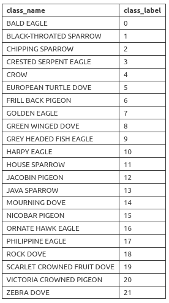
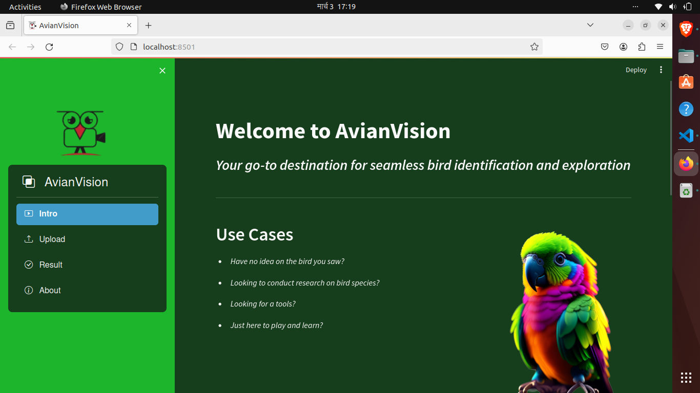

# MULTI-CLASSIFICATION-OF-BIRD-SPECIES

MultiClassification of Bird Species is a Computer Vision project created to recognize different kinds of bird species through an image.

You need to download the tutorials video, model and label files but don't worry, They will be downloaded automatically. Just be Patient!

***Datasets Description***

2970 photos total, split up into 22 target classes, each having 130 images with a 222*222 form, make up the dataset for the identification of bird species. This dataset, which is a subset of the overall dataset, has the following 22 classes:



# SCREENSHOTS OF THIS PROJECTS



# HOW TO RUN THE CODE
## Installation

**1) Clone the repository to your local machine:***

```
git clone https://github.com/David-Thapa/Multi-Classification-of-Bird-Species
```
**2) Install the Required Dependencies from requirement.txt:**

Using Pip:
```
pip install -r requirements.txt
```
Using Conda
```
conda install --file requirements.txt
```

## Usage
**1) Navigate to the project Directory:**
```
cd Multi-Classification-of-Bird-Species
```

**2) Create your virtual Environment:**

On Windows
```
python -m venv env
```
on Linux
```
conda create -p ./venv
```

**3) Activate your virtual Environment:**

Using Pip:
```
env/Scripts/activate
```
Using Conda:
```
conda activate venv/
```

**4) Run code**

In Terminal:
```
streamlit run app.py
```